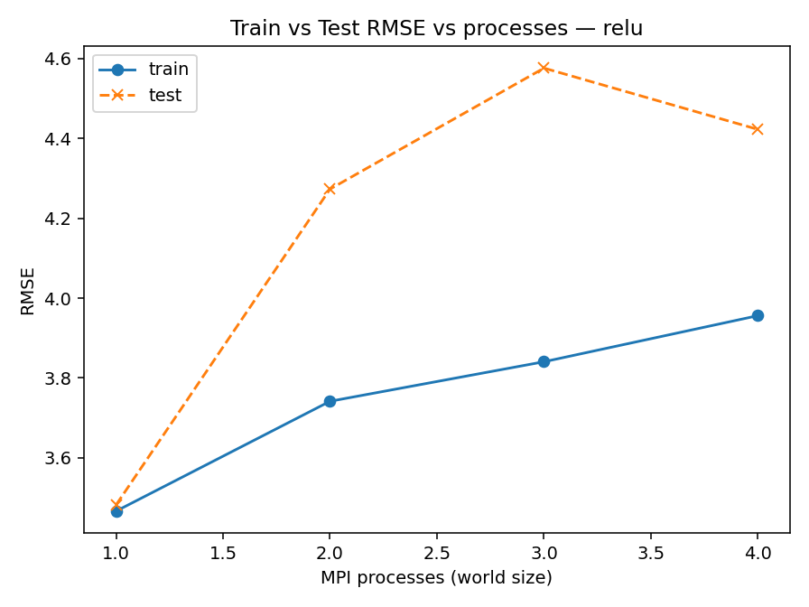
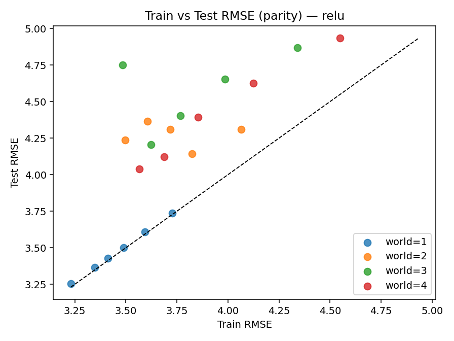
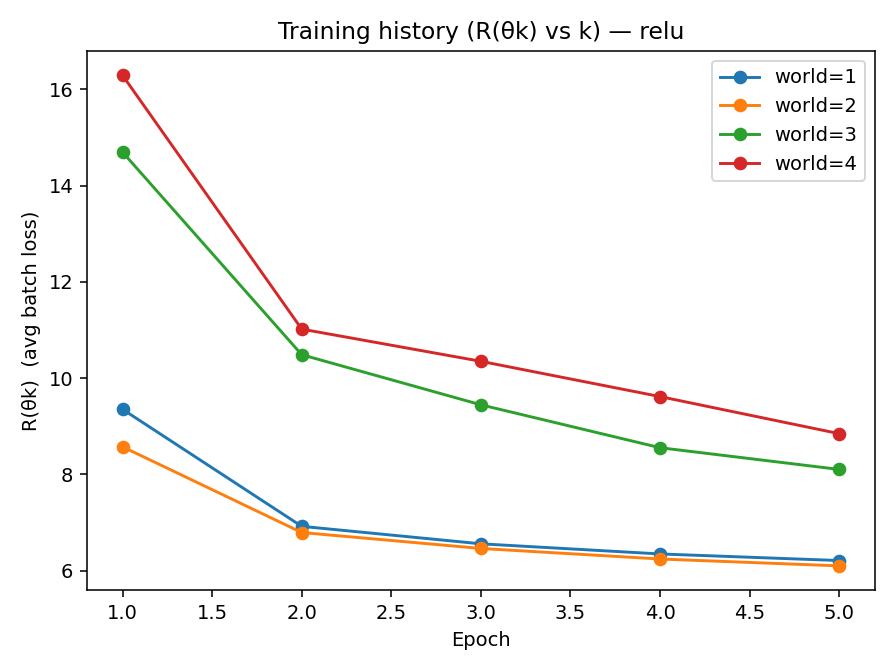
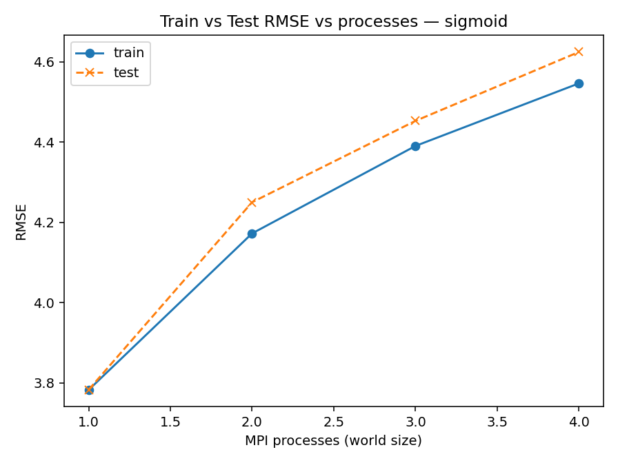
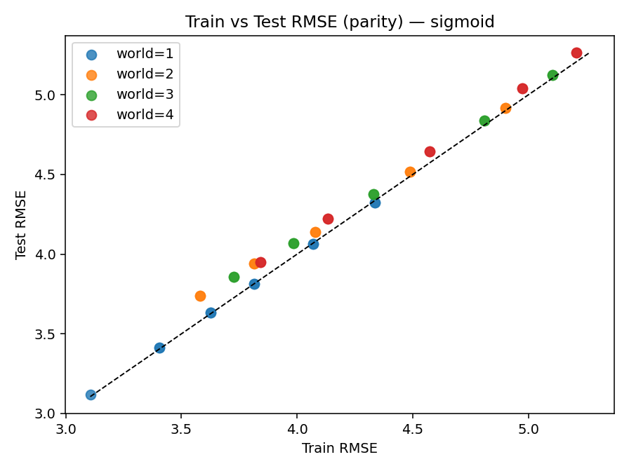
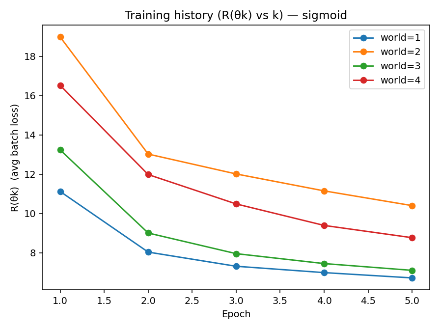
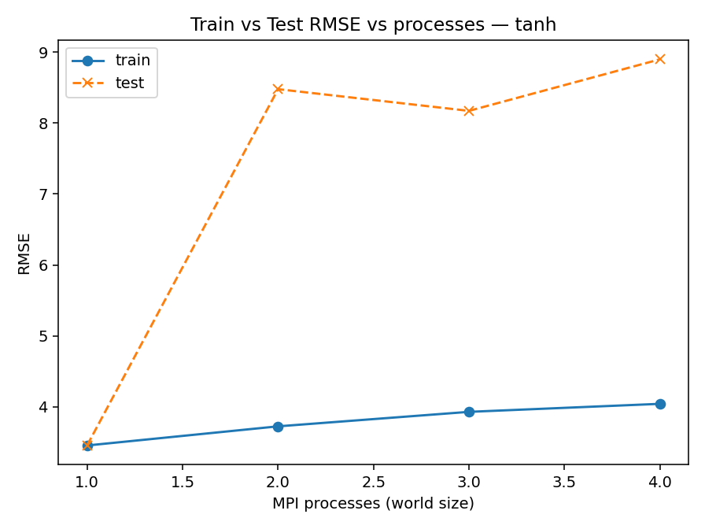
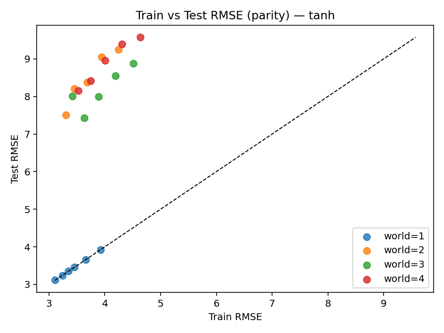
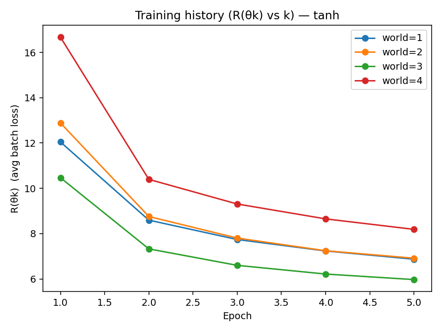
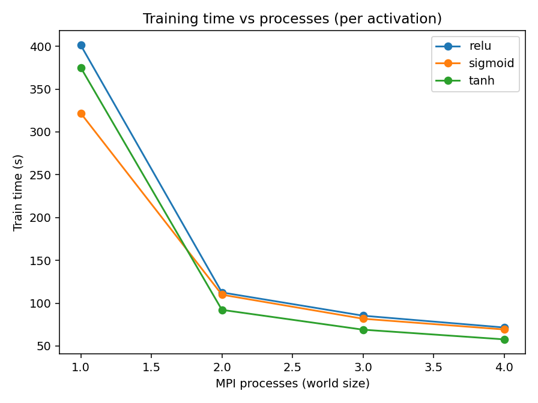

# Per-Activation Results

## rmse_lines_relu.png

## rmse_scatter_relu.png

## loss_curves_relu.png

## rmse_lines_sigmoid.png

## rmse_scatter_sigmoid.png

## loss_curves_sigmoid.png

## rmse_lines_tanh.png

## rmse_scatter_tanh.png

## loss_curves_tanh.png

## time_vs_procs_by_activation.png

